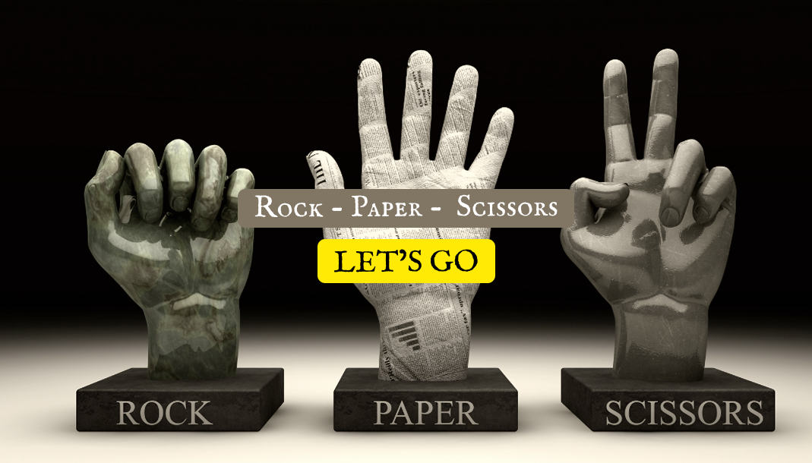
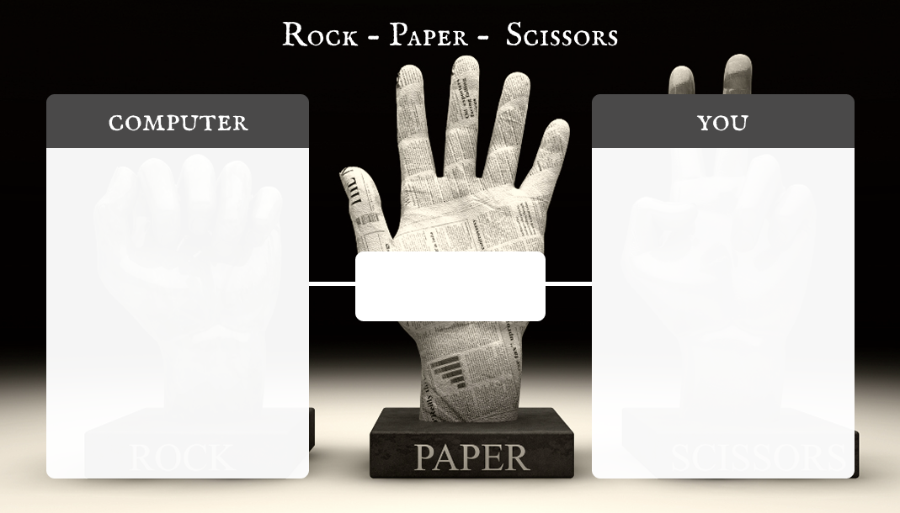
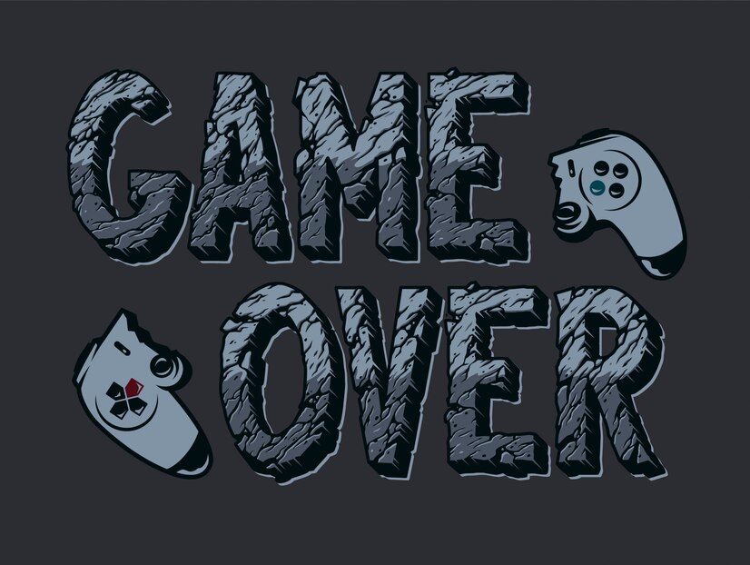

# 🎮 Rock Paper Scissors - Computer Vision Edition

  

## 📌 Project Overview 
This project is an interactive Rock-Paper-Scissors Game where players can compete against the computer by posing hand gestures. Using image processing techniques, the system captures the user's gesture, processes it to identify whether it's "Rock," "Paper," or "Scissors," and determines the winner based on classic game rules. The application is built with Python and showcases real-time image processing visualization.

## 🛠️ Technologies Used

Programming Language: Python

Libraries: OpenCV

Image Processing Techniques: Greyscale, Thresholding, Background Removal, Contour Detection

Visualization: Matplotlib for step-by-step image transformations

## 🔄 How to Run the Application
1. Clone the repository  
   git clone <repository-url>
   
2. Navigate to the project directory  
   cd rock-paper-scissors

3. Install the dependencies  
   pip install -r requirements.txt

4. Run the application
   python main.py

## Game Screens

  
   

## How to Play
Position your hand in the right side detection box

Make one of these gestures 

✊ Closed fist = Rock  
✋ Open palm = Paper  
✌️ Two fingers = Scissors  

The computer will automatically respond

First to win 3 rounds wins the match!   

## 🎮 Game Rules
✊ Rock crushes ✌️ Scissors  
✌️ Scissors cuts 📄 Paper  
📄 Paper covers ✊ Rock  
🔄 If both gestures match, it's a 🤝 Tie

## Features
- Real-time ✊✋✌️ detection using webcam
- Interactive score tracking
- Best of 5 rounds system
- Animated countdown timer
- Responsive full screen UI
- User-friendly interface with smooth gameplay.
- Error handling and feedback for better user experience.

## Controls

ESC = Quit game

Mouse = Click buttons on result screen 
